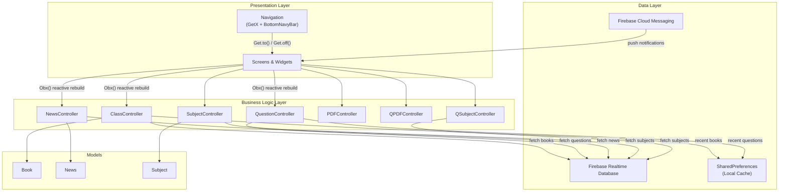
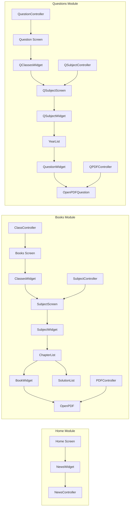
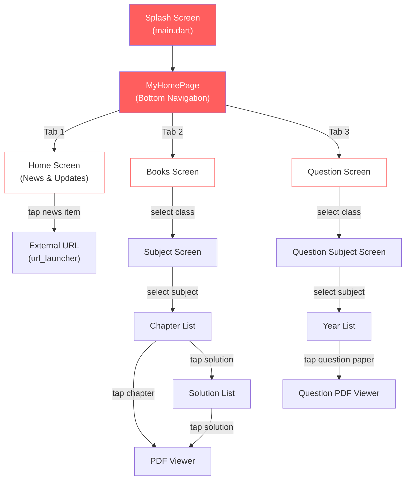

# Architecture Diagram

## High-Level Architecture

```mermaid
graph TB
    subgraph "Presentation Layer"
        UI["Screens & Widgets"]
        Nav["Navigation<br/>(GetX + BottomNavyBar)"]
    end

    subgraph "Business Logic Layer"
        CC["ClassController"]
        QC["QuestionController"]
        NC["NewsController"]
        SC["SubjectController"]
        PC["PDFController"]
        QPC["QPDFController"]
        QSC["QSubjectController"]
    end

    subgraph "Data Layer"
        FB["Firebase Realtime Database"]
        SP["SharedPreferences<br/>(Local Cache)"]
        FCM["Firebase Cloud Messaging"]
    end

    subgraph "Models"
        BM["Book"]
        NM["News"]
        SM["Subject"]
    end

    UI -->|"Obx() reactive rebuild"| CC
    UI -->|"Obx() reactive rebuild"| QC
    UI -->|"Obx() reactive rebuild"| NC
    UI --> SC
    UI --> PC
    UI --> QPC
    UI --> QSC

    Nav -->|"Get.to() / Get.off()"| UI

    CC -->|"fetch books"| FB
    CC -->|"recent books"| SP
    QC -->|"fetch questions"| FB
    QC -->|"recent questions"| SP
    NC -->|"fetch news"| FB
    SC -->|"fetch subjects"| FB
    QSC -->|"fetch subjects"| FB

    CC --> BM
    NC --> NM
    SC --> SM

    FCM -->|"push notifications"| UI
```

## Module Architecture

```mermaid
graph LR
    subgraph "Home Module"
        HS["Home Screen"]
        NW["NewsWidget"]
        NC2["NewsController"]
    end

    subgraph "Books Module"
        BS["Books Screen"]
        SBS["SubjectScreen"]
        CL["ChapterList"]
        SL["SolutionList"]
        OP["OpenPDF"]
        CW["ClassesWidget"]
        SW["SubjectWidget"]
        BW["BookWidget"]
        CC2["ClassController"]
        SC2["SubjectController"]
        PC2["PDFController"]
    end

    subgraph "Questions Module"
        QS["Question Screen"]
        QSS["QSubjectScreen"]
        YL["YearList"]
        OPQ["OpenPDFQuestion"]
        QCW["QClassesWidget"]
        QSW["QSubjectWidget"]
        QW["QuestionWidget"]
        QC2["QuestionController"]
        QSC2["QSubjectController"]
        QPC2["QPDFController"]
    end

    HS --> NW
    NW --> NC2

    BS --> CW
    CW --> SBS
    SBS --> SW
    SW --> CL
    CL --> BW
    BW --> OP
    CL --> SL
    CC2 --> BS
    SC2 --> SBS
    PC2 --> OP

    QS --> QCW
    QCW --> QSS
    QSS --> QSW
    QSW --> YL
    YL --> QW
    QW --> OPQ
    QC2 --> QS
    QSC2 --> QSS
    QPC2 --> OPQ
```

## Screen Navigation Flow

```mermaid
graph TD
    SP["Splash Screen<br/>(main.dart)"] --> MH["MyHomePage<br/>(Bottom Navigation)"]

    MH -->|"Tab 1"| HOME["Home Screen<br/>(News & Updates)"]
    MH -->|"Tab 2"| BOOKS["Books Screen"]
    MH -->|"Tab 3"| QUESTIONS["Question Screen"]

    HOME -->|"tap news item"| URL["External URL<br/>(url_launcher)"]

    BOOKS -->|"select class"| SUB1["Subject Screen"]
    SUB1 -->|"select subject"| CHAP["Chapter List"]
    CHAP -->|"tap chapter"| PDF1["PDF Viewer"]
    CHAP -->|"tap solution"| SOL["Solution List"]
    SOL -->|"tap solution"| PDF1

    QUESTIONS -->|"select class"| SUB2["Question Subject Screen"]
    SUB2 -->|"select subject"| YEAR["Year List"]
    YEAR -->|"tap question paper"| PDF2["Question PDF Viewer"]

    style SP fill:#FF5E5E,color:#fff
    style MH fill:#FF5E5E,color:#fff
    style HOME fill:#fff,stroke:#FF5E5E
    style BOOKS fill:#fff,stroke:#FF5E5E
    style QUESTIONS fill:#fff,stroke:#FF5E5E
```
