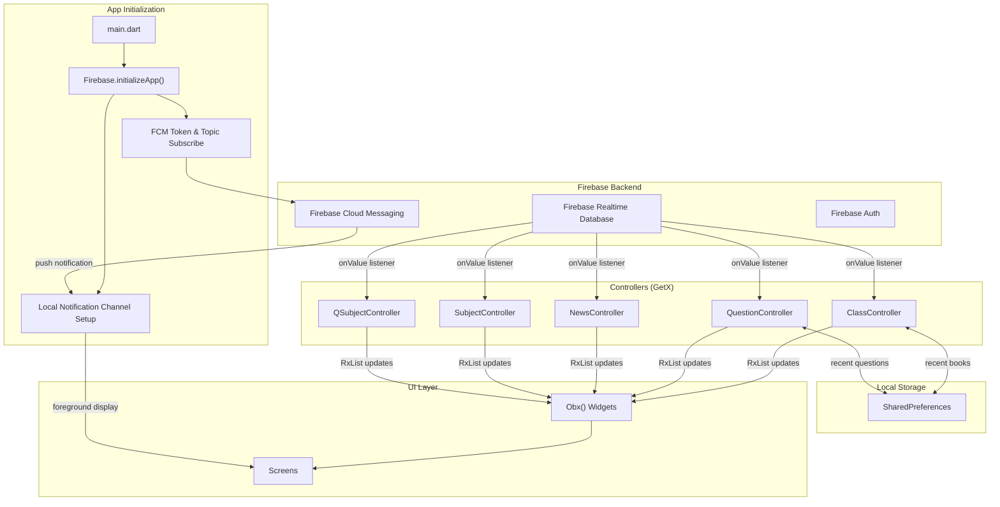
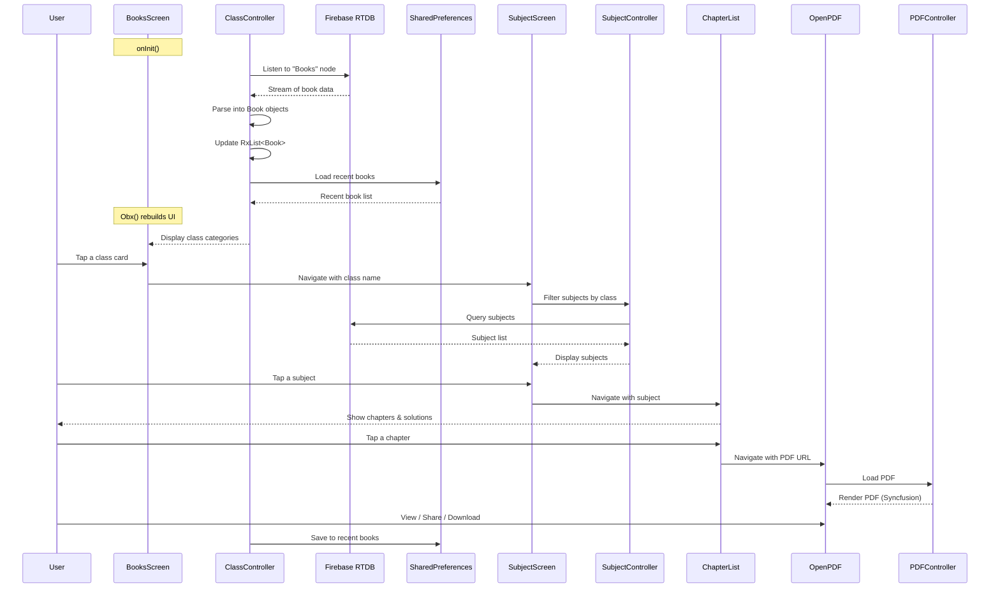
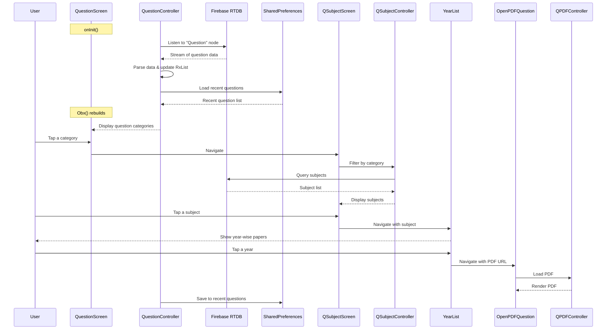
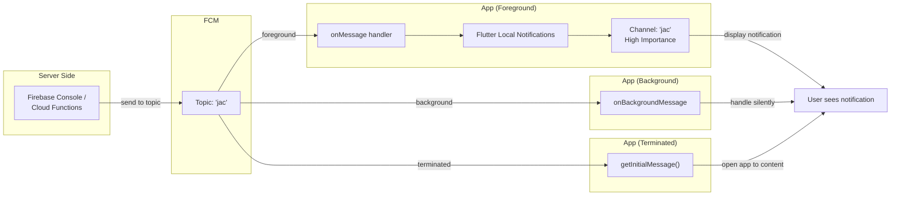
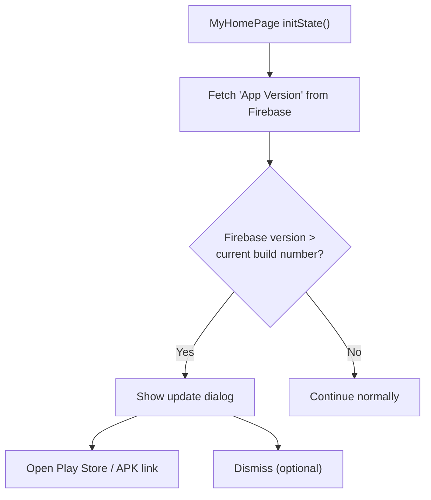

# Data Flow Diagram

## Overall Data Flow

```mermaid
flowchart TD
    subgraph "Firebase Backend"
        FRTDB["Firebase Realtime Database"]
        FCMS["Firebase Cloud Messaging"]
        FAUTH["Firebase Auth"]
    end

    subgraph "App Initialization"
        MAIN["main.dart"]
        FINIT["Firebase.initializeApp()"]
        FCMSETUP["FCM Token & Topic Subscribe"]
        NOTIF["Local Notification Channel Setup"]
    end

    subgraph "Controllers (GetX)"
        CC["ClassController"]
        QC["QuestionController"]
        NC["NewsController"]
        SC["SubjectController"]
        QSC["QSubjectController"]
    end

    subgraph "Local Storage"
        SPREFS["SharedPreferences"]
    end

    subgraph "UI Layer"
        OBX["Obx() Widgets"]
        SCREENS["Screens"]
    end

    MAIN --> FINIT
    FINIT --> FCMSETUP
    FINIT --> NOTIF
    FCMSETUP --> FCMS

    FRTDB -->|"onValue listener"| CC
    FRTDB -->|"onValue listener"| QC
    FRTDB -->|"onValue listener"| NC
    FRTDB -->|"onValue listener"| SC
    FRTDB -->|"onValue listener"| QSC

    CC -->|"RxList updates"| OBX
    QC -->|"RxList updates"| OBX
    NC -->|"RxList updates"| OBX
    SC -->|"RxList updates"| OBX
    QSC -->|"RxList updates"| OBX

    CC <-->|"recent books"| SPREFS
    QC <-->|"recent questions"| SPREFS

    OBX --> SCREENS
    FCMS -->|"push notification"| NOTIF
    NOTIF -->|"foreground display"| SCREENS
```

## Books Data Flow

```mermaid
sequenceDiagram
    participant User
    participant BooksScreen
    participant ClassController
    participant Firebase as Firebase RTDB
    participant SharedPrefs as SharedPreferences

    Note over BooksScreen: onInit()
    ClassController->>Firebase: Listen to "Books" node
    Firebase-->>ClassController: Stream of book data
    ClassController->>ClassController: Parse into Book objects
    ClassController->>ClassController: Update RxList<Book>

    ClassController->>SharedPrefs: Load recent books
    SharedPrefs-->>ClassController: Recent book list

    Note over BooksScreen: Obx() rebuilds UI
    ClassController-->>BooksScreen: Display class categories

    User->>BooksScreen: Tap a class card
    BooksScreen->>SubjectScreen: Navigate with class name
    SubjectScreen->>SubjectController: Filter subjects by class
    SubjectController->>Firebase: Query subjects
    Firebase-->>SubjectController: Subject list
    SubjectController-->>SubjectScreen: Display subjects

    User->>SubjectScreen: Tap a subject
    SubjectScreen->>ChapterList: Navigate with subject
    ChapterList-->>User: Show chapters & solutions

    User->>ChapterList: Tap a chapter
    ChapterList->>OpenPDF: Navigate with PDF URL
    OpenPDF->>PDFController: Load PDF
    PDFController-->>OpenPDF: Render PDF (Syncfusion)

    User->>OpenPDF: View / Share / Download
    ClassController->>SharedPrefs: Save to recent books
```

## Question Bank Data Flow

```mermaid
sequenceDiagram
    participant User
    participant QuestionScreen
    participant QuestionController
    participant Firebase as Firebase RTDB
    participant SharedPrefs as SharedPreferences

    Note over QuestionScreen: onInit()
    QuestionController->>Firebase: Listen to "Question" node
    Firebase-->>QuestionController: Stream of question data
    QuestionController->>QuestionController: Parse data & update RxList

    QuestionController->>SharedPrefs: Load recent questions
    SharedPrefs-->>QuestionController: Recent question list

    Note over QuestionScreen: Obx() rebuilds
    QuestionController-->>QuestionScreen: Display question categories

    User->>QuestionScreen: Tap a category
    QuestionScreen->>QSubjectScreen: Navigate
    QSubjectScreen->>QSubjectController: Filter by category
    QSubjectController->>Firebase: Query subjects
    Firebase-->>QSubjectController: Subject list
    QSubjectController-->>QSubjectScreen: Display subjects

    User->>QSubjectScreen: Tap a subject
    QSubjectScreen->>YearList: Navigate with subject
    YearList-->>User: Show year-wise papers

    User->>YearList: Tap a year
    YearList->>OpenPDFQuestion: Navigate with PDF URL
    OpenPDFQuestion->>QPDFController: Load PDF
    QPDFController-->>OpenPDFQuestion: Render PDF

    QuestionController->>SharedPrefs: Save to recent questions
```

## Notification Flow

```mermaid
flowchart LR
    subgraph "Server Side"
        ADMIN["Firebase Console /<br/>Cloud Functions"]
    end

    subgraph "FCM"
        TOPIC["Topic: 'jac'"]
    end

    subgraph "App (Foreground)"
        FH["onMessage handler"]
        LN["Flutter Local Notifications"]
        CH["Channel: 'jac'<br/>High Importance"]
    end

    subgraph "App (Background)"
        BH["onBackgroundMessage"]
    end

    subgraph "App (Terminated)"
        INIT["getInitialMessage()"]
    end

    ADMIN -->|"send to topic"| TOPIC
    TOPIC -->|"foreground"| FH
    TOPIC -->|"background"| BH
    TOPIC -->|"terminated"| INIT

    FH --> LN
    LN --> CH
    CH -->|"display notification"| USER["User sees notification"]

    BH -->|"handle silently"| USER
    INIT -->|"open app to content"| USER
```

## App Update Check Flow

```mermaid
flowchart TD
    START["MyHomePage initState()"] --> FETCH["Fetch 'App Version' from Firebase"]
    FETCH --> COMPARE{"Firebase version ><br/>current build number?"}
    COMPARE -->|"Yes"| DIALOG["Show update dialog"]
    COMPARE -->|"No"| CONTINUE["Continue normally"]
    DIALOG --> UPDATE["Open Play Store / APK link"]
    DIALOG --> DISMISS["Dismiss (optional)"]
```
